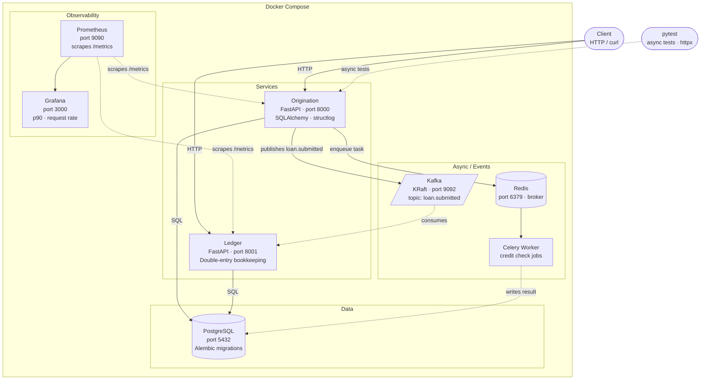
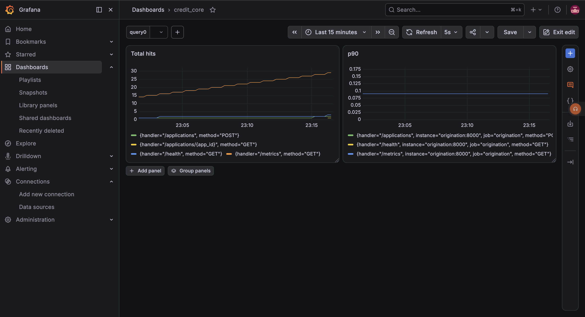

# Backend Infrastructure Refresher — CreditCore

A minimal project to refresh hands-on familiarity with backend infrastructure: async APIs, microservices, event driven architecture, observability, and containerisation, built around a trivial lending domain. Each technology is wired in just enough to work; none are used in depth.


## Architecture Overview



## Tech Stack

- **FastAPI** — REST API framework
- **PostgreSQL** — primary database
- **SQLAlchemy + Alembic** — ORM and migrations
- **Redis + Celery** — async background jobs
- **Kafka** — event publishing and consumption
- **structlog** — structured JSON logging
- **Prometheus** — metrics scraping
- **Grafana** — metrics visualisation
- **Docker** — containerised infrastructure

## Services

- **Origination** (port 8000) — loan application lifecycle, idempotency, credit check jobs
- **Ledger** (port 8001) — double-entry bookkeeping for financial records

## Architecture

```
Client → Origination Service → PostgreSQL
                             → Redis (Celery background jobs)
                             → Kafka (loan.submitted events)
                             → Ledger Service → PostgreSQL

Prometheus → scrapes /metrics from Origination + Ledger
Grafana    → visualises metrics from Prometheus
```

## Running Locally

### Prerequisites
- Docker + Docker Compose
- make

### Start everything

```bash
make up
```

### Run migrations

```bash
# Origination
cd services/origination
alembic upgrade head

# Ledger
cd services/ledger
alembic upgrade head
```

### Run tests

```bash
cd services/origination
pytest tests/ -v
```

## API Endpoints

### Origination Service

| Method | Endpoint | Description |
|--------|----------|-------------|
| POST | `/applications` | Create loan application |
| GET | `/applications/{id}` | Get application by ID |
| PATCH | `/applications/{id}/submit` | Submit application |
| GET | `/tasks/{task_id}` | Check credit check job status |
| GET | `/health` | Health check |

### Ledger Service

| Method | Endpoint | Description |
|--------|----------|-------------|
| POST | `/postings` | Create debit + credit entry for a loan |
| GET | `/postings/{loan_id}` | Get all ledger entries for a loan |

## Observability

Prometheus and Grafana are included in the Docker setup.

| Service | URL |
|---------|-----|
| Prometheus | http://localhost:9090 |
| Grafana | http://localhost:3000 |

Both services expose a /metrics endpoint scraped by Prometheus every 15s. Open Grafana at http://localhost:3000, add Prometheus as a datasource (http://prometheus:9090), and query metrics like http_requests_total for request counts and histogram_quantile(0.90, rate(http_request_duration_seconds_bucket[5m])) for p90 latency.



## Build Phases

### Phase 1 — FastAPI + PostgreSQL
Set up the Origination service with FastAPI. Defined the `LoanApplication` model with SQLAlchemy ORM, wired up an async PostgreSQL connection with `asyncpg`, and built CRUD endpoints for creating and fetching loan applications.

### Phase 2 — Alembic Migrations
Introduced Alembic for schema versioning. Migration scripts handle table creation and column changes, keeping the database schema in sync across environments without manual SQL.

### Phase 3 — Idempotency
Added idempotency key support on the `POST /applications` endpoint. Duplicate requests with the same key return the original response instead of creating a new record — a standard pattern for safe retries in payment and lending systems.

### Phase 4 — Celery + Redis
Wired up Redis as a task broker and Celery as a worker. Submitting a loan application enqueues an async credit check job. The worker processes it in the background and updates the application status — decoupling slow operations from the request lifecycle.

### Phase 5 — Kafka
Added Kafka (KRaft mode, no Zookeeper) for event-driven communication. Origination publishes a `loan.submitted` event on application submission. Ledger consumes it via an async Kafka consumer running as a background task on startup.

### Phase 6 — Ledger Service
Built a second microservice for double-entry bookkeeping. Every loan submission creates a matching debit and credit entry, reflecting standard accounting practice. Ledger has its own FastAPI app, database, and Alembic migrations — fully independent of Origination.

### Phase 7 — Docker
Containerised all services with individual Dockerfiles. `docker-compose.yml` orchestrates Origination, Ledger, Celery worker, PostgreSQL, Redis, and Kafka with healthchecks and dependency ordering. A `Makefile` wraps common commands (`make up`, `make down`, `make logs`).

### Phase 8 — Observability
Added `prometheus-fastapi-instrumentator` to both services to expose a `/metrics` endpoint. Prometheus scrapes metrics every 15s. Grafana visualises request rate, p90 latency, and error rates per endpoint — giving production-style visibility into the running system.

